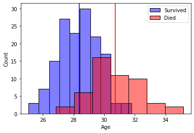

```python
import pandas as pd
import seaborn as sns
import numpy as np
df = pd.read_html('https://github.com/datasciencedojo/datasets/blob/master/titanic.csv')[0]
```


```python
import matplotlib.pyplot as plt
```


```python
df = pd.DataFrame(df)
```

## Seperating Survival Outcome


```python
survived = df[df['Survived'] == 1]
dead = df[df['Survived'] == 0]
```

## Surivived Distribution Plot

- H0 Average age of passangers that survived was less than 29
- Reject the null meaning age is greater than 29


```python
import matplotlib.pyplot as plt
import seaborn as sns
import numpy as np
from scipy.stats import ttest_1samp

#Taking random samples of 150
live_on = []
for i in range(150):
    aa = np.random.choice(survived[survived['Age'].notna()].Age, 150).mean()
    live_on.append(aa)
died = []
for i in range(50):
    sample = np.random.choice(dead[dead['Age'].notna()].Age, 80).mean()
    died.append(sample)
    
    
    
# Plot the histograms of each distribution
sns.histplot(live_on, color='blue', alpha=0.5, label='Survived')
sns.histplot(died, color='red', alpha=0.5, label='Died')
plt.axvline(np.mean(live_on), color='blue')
plt.axvline(np.mean(died), color='red')

# Calculate and print statistics
print("Survived Mean: ",np.mean(live_on))
#Calculating 90 and 95% confidence interval 
print("Survived 90% confidence interval: " ,np.percentile(live_on, [5,95]))
print("Survived 95% confidence interval: " ,np.percentile(live_on, [2.5,97.5]))
print("Died Mean: ",np.mean(died))
print("Died 90% confidence interval: " ,np.percentile(died, [5,95]))
print("Died 95% confidence interval: " ,np.percentile(died, [2.5,97.5]))

# Conduct a t-test
tstat, pval = ttest_1samp(live_on, 30)
print("Survived t-test p-value: ", pval/2)
tstat, pval = ttest_1samp(died, 30)
print("Died t-test p-value: ", pval/2)

# Set axis labels and legend
plt.xlabel('Age')
plt.ylabel('Count')
plt.legend()

```

    Survived Mean:  28.375821333333334
    Survived 90% confidence interval:  [26.15347    30.33917667]
    Survived 95% confidence interval:  [25.85727333 30.71923   ]
    Died Mean:  30.744125
    Died 90% confidence interval:  [28.2653125 33.6103125]
    Died 95% confidence interval:  [27.685   34.62625]
    Survived t-test p-value:  1.2067883108558623e-31
    Died t-test p-value:  0.001689864409444074


    <matplotlib.legend.Legend at 0x7fc15128b250>


    

    


In both cases we reject the null because the p vals are < 5 showing low probability of H0 being correct:
- The Survived t-test p-value of 1.206788310e ( very small number) indicates that the mean age of individuals who survived is significantly different from 30 at the 95% confidence level.
- The Died t-test p-value of 0.0017 indicates that the mean age of individuals who died is significantly different from 30 at the 95% confidence level.


```python

```
